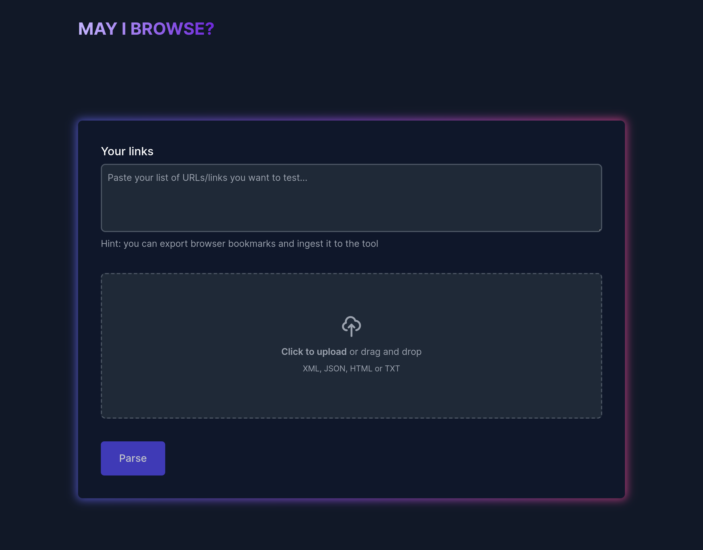
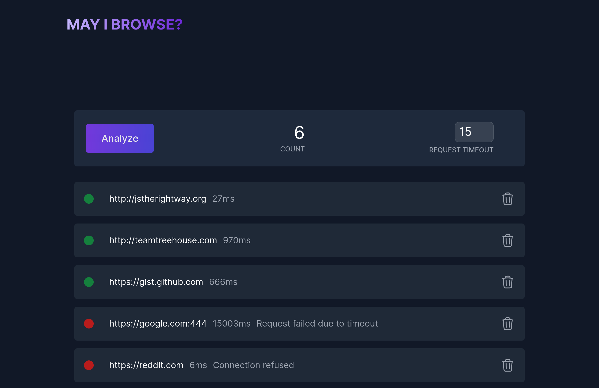

# 🌐 May I Browse?

This simple application is designed to enhance the user experience by allowing the determination of website accessibility. It provides a solution to check if any of your preferred websites are being restricted by the corporate proxy or any other network security devices.

## Screenshots

## References

- [Go by Example](https://gobyexample.com/)
